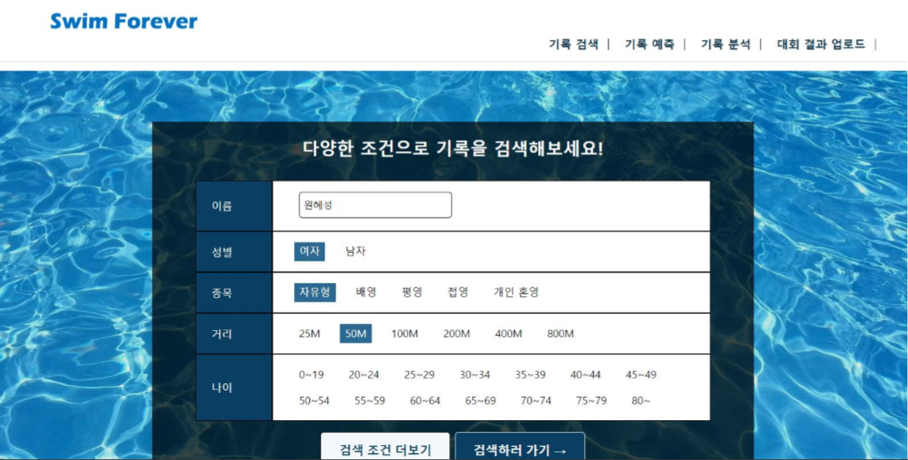
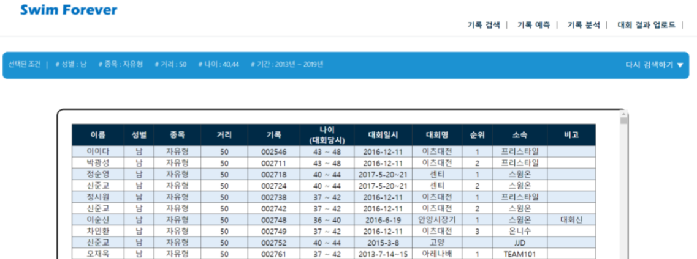
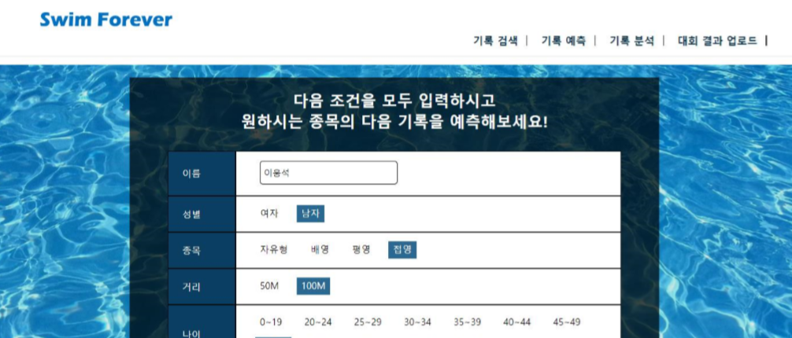
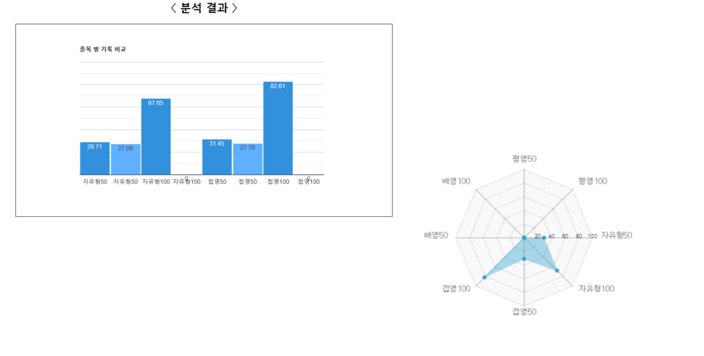
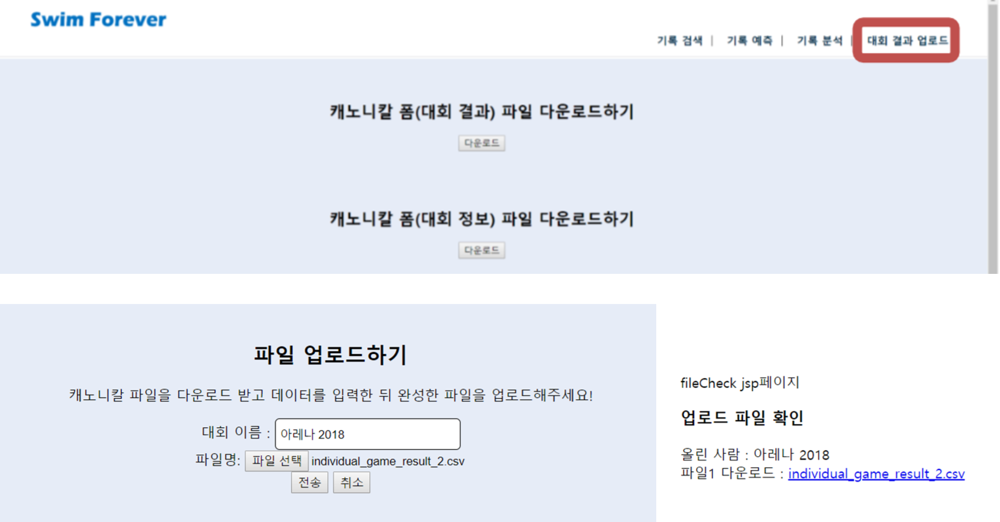

# Project title
한국 아마추어 수영 대회 결과에 대한 간단한 검색과 선수의 기록을 토대로 분석 및 간단한 예측 서비스를 제공하는 웹 사이트

## How to use?
서비스를 종료했기 때문에 실제로 사이트에 접속할 수는 없다.

## Screenshots
검색 화면.

검색 결과 화면. 상단 바에 입력한 검색 조건을 명시하여 사용자가 어떤 조건에 해당하는 결과를 보고 있는지 헷갈리지 않도록 해준다.

사용자의 기록을 토대로 사용자에게 없는 기록에 대한 예측을 해주는 서비스. 선형회귀 분석을 이용한 간단한 수준의 분석이었다.

종목 별로 사용자의 기록을 한 눈에 비교하기 쉽게 그래프로 시각화 해주는 서비스.

아마추어 수영 대회에 대한 형식 파일을 제공하여 사용자가 다운로드 받을 수 있도록 했다.
사용자는 다운받은 형식에 따라 수영 대회 정보를 입력, 저장한 뒤 파일을 다시 SMF 서버에 업로드할 수 있도록 파일 다운로드 및 업로드 서비스를 제공했다.

## Tech/framework used
html
css
jsp
Apache
JavaScript
jQuery
R
java

## API Reference
Google Chart API
Nwagon - 오픈소스 차트 라이브러리
cos.jar (파일 업로드 및 다운로드에 사용. 상용화 페이지가 아니기 때문에 라이센스 별도 구입은 없었음)

## Authors
Jiyun Lee

<!--
## Getting Started
## Code style
## Features
## Code Example
## Installation
## Tests
## How to use?
## Contribute
## Credits
## License-->
